# Media application
## Features
#### Multi-Part File Upload
- with limit of maximum allowed active upload requests
- media file spliting to smaller chunks, keep track of the chunks uploaded
- currently support only local file system on Linux server
#### Access Control List (ACL) Management
- File resource owner can modify file-level ACL, whether a transcoded file is visible to everyone
- Privileged users and the owner can modify user-level ACL, which users can transcode the file, view a transcoded file, or edit access permission on other users
#### Transcoding
- For video, currently support only mp4 (input) to HLS (output)
- For image, currently support JPG / GIF / PNG / TIFF
- configurable limit for custom quality resolutions
- asynchronous job for long-running transcoding tasks, with progress monitor
- concurrent transcoding of multiple files is supported
#### video streaming
- currently support only HLS
- optional caching file-streaming elements in reverse proxy (currnetly Nginx)

## High-Level Architecture

```mermaid
flowchart LR
    subgraph Clients
      PUBU(["👤 Public Users"])
      subgraph PrivilegedClients
        FRESO(["👤 File Resource Owner"])
        PRIVU(["👤 Privileged Users"])
      end
    end
    
    subgraph caching
        CACHE_NGINX[Nginx]
    end

    subgraph RPC-comsumer
        TRANS_ASYNC_JOB[Asynchronous Transcoding Job]
    end

    subgraph Web-Service-Layer
        MPFU[Multipart File Upload]
        ACLMGT[Access-Control List management]
        subgraph "Transcoding"
          TRANS_INIT[Initialization]
          TRANS_PROG_MON[Progress Monitor]
        end
        subgraph Transcoded-File-Fetch
          IMG_FETCH[Image]
          VID_STREAM[Video Streaming]
        end
    end

    subgraph Data-Store-Layer
      MARIA[MariaDB]
    end
    
    FRESO --> MPFU
    PrivilegedClients --> ACLMGT
    PrivilegedClients --> TRANS_INIT
    PrivilegedClients --> TRANS_PROG_MON
    TRANS_INIT --> TRANS_ASYNC_JOB
    Clients --> CACHE_NGINX --> Transcoded-File-Fetch
    Web-Service-Layer --> Data-Store-Layer
    RPC-comsumer --> Data-Store-Layer
```



## Prerequisite 
| name | version required |
|------|------------------|
| Docker | `28.0.4` |
| [Cmake](https://cmake.org/cmake/help/latest/index.html) | `>= 3.28.3` |
| [gcc](https://gcc.gnu.org/onlinedocs/) | `>= 14.2.0` |
| Python | `>= 3.13.7` |
| RabbitMQ (Docker) | `>= 3.13` |

Note: 
* other infrastructures (e.g. database), tools, and 3rd-party dependency libraries are automatically built and installed in during docker image build. 

## Build
The build process include required 3rd-party library installation and executable image compile for development server and test server.

```bash
docker build --file ./media/infra/apps.dockerfile --tag media-backend-base:latest .
docker build --file ./media/infra/helpertool.dockerfile --tag media-helper-tool:latest .
```

### Configuration
This command should be running during docker build, since all 3rd-party libraries are installed inside docker image
```bash
cd /PATH/TO/PROJECT_HOME/services/media
mkdir -p build
cd build

CC=$(which gcc)  PKG_CONFIG_PATH="<YOUR_PATH_TO_PKG_CFG>" \
    cmake  -DCMAKE_BUILD_TYPE=Release  -DCMAKE_EXPORT_COMPILE_COMMANDS=1  ..
```
Note `<YOUR_PATH_TO_PKG_CFG>` should include paths of required 3rd-party libraries :
- `/PATH/TO/brotli/pkgconfig`
- `/PATH/TO/libuv/pkgconfig`
- `/PATH/TO/h2o/pkgconfig`
- `/PATH/TO/jansson/pkgconfig`
- `/PATH/TO/rhonabwy/pkgconfig`
- `/PATH/TO/gnutls/pkgconfig`
- `/PATH/TO/nettle/pkgconfig`
- `/PATH/TO/p11-kit/pkgconfig`
- `/PATH/TO/mariadb/pkgconfig`
- `/PATH/TO/rabbitmq-c/pkgconfig`
- `/PATH/TO/ffmpeg/pkgconfig`
- `/PATH/TO/libuuid/pkgconfig`
- `/PATH/TO/libcurl/pkgconfig`
- `/PATH/TO/nghttp2/pkgconfig`
- `/PATH/TO/openssl/pkgconfig`

To run other tools e.g. code formatter in your local machine for development purpose, use the cmake setup below that skips 3rd-party library check
```bash
cmake  -DCMAKE_BUILD_TYPE=Debug  -DCMAKE_EXPORT_COMPILE_COMMANDS=1 -DSKIP_PKG_CHECK=ON ..
```

### Run Development Server
the command below includes database schema migration, certificate renewal, API server and RPC consumer start.
```bash
docker compose --file ./infra/docker-compose-generic.yml --file ./infra/docker-compose-dev.yml \
    --env-file ./infra/interpolation-dev.env up --detach
```

### Test
```bash
docker compose --file ./infra/docker-compose-utest.yml --env-file ./infra/interpolation-test.env up --detach

docker compose --file ./infra/docker-compose-generic.yml --file ./infra/docker-compose-itest.yml \
    --env-file ./infra/interpolation-test.env up --detach
```
### Reference
- run `make -C ./build build-help` for build helper doc after `cmake` command above completes successfully.
- [API documentation (OpenAPI v3.0 specification)](./doc/apidoc.yaml)
