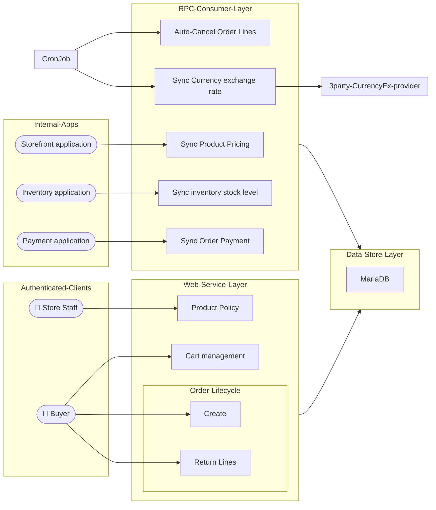

# Order Processing service
## Features
#### Saleable Product Polices
- each product defines policies including reservation limit, warranty duration, auto-cancel time
- policies will be applied to each new order once created
#### Product Pricing Rules
- including base pricing, custom attribute pricing, and multi-currency support
- implements time-Based Pricing, it ensures price validity within specified start and end times
- synchronizes pricing update made by store staff from storefront application
#### Cart Management
- maintains cart content for authenticated users
#### Order Lifecycle Management
- creates order with respect to permission model, quota limit, inventory reservation
- supports returns for individual order lines with appropriate validation
- synchronizes order payment status with payment application
- updates stock level with inventory application, to maintain accurate product availability.

## High-Level Architecture



## Essential Environment Variables
|variable|description|example|
|--------|-----------|-------|
|`SYS_BASE_PATH`| common path of all the services| `${PWD}/..` |
|`SERVICE_BASE_PATH`| base path of the order service | `${PWD}` |
|`CONFIG_FILE_PATH`| path relative to `SERVICE_BASE_PATH` folder, it is JSON configuration file | `settings/development.json` |
||||


## Build
For full build / test instructions please refer to this github action workflow script :
- [`orderproc-ci.yaml`](../../.github/workflows/orderproc-ci.yaml)
- [`orderproc-3pty-currencyex.yaml`](../../.github/workflows/orderproc-3pty-currencyex.yaml)

### Pre-requisite
| type | name | version required |
|------|------|------------------|
| SQL Database | MariaDB | `11.8.2` |
| Rust toolchain | [rust](https://github.com/rust-lang/rust), including Cargo, Clippy | `>= 1.86.0` |
| DB migration | [liquibase](https://github.com/liquibase/liquibase) | `>= 4.33` |

### Optional features
You can build / test this application with following optional features
- mariaDB, append `--features mariadb` to Rust `cargo` command 

### Commands for build
```shell
cd ${SERVICE_BASE_PATH}
docker build --file order/infra/Dockerfile --target builder0  --tag ordermgt-with-devtools:latest  .
docker build --file order/infra/Dockerfile --tag ordermgt-backend-base:latest  .
```

- the first-stage build image `ordermgt-with-devtools` is used for running other test cases coupled with external services.
  - it builds all applications in the stage including the commands `cargo build  --bin web` and `cargo build --bin rpc_consumer`
- the second-stage build image `ordermgt-backend-base`  (TODO)


## Run
### Development API server
```shell=?
cd ${SERVICE_BASE_PATH}

SYS_BASE_PATH="${PWD}/.."  SERVICE_BASE_PATH="${PWD}" \
    CONFIG_FILE_PATH="settings/development.json" \
    cargo run  --bin web --features "mariadb amqprs"
```
### Development RPC consumer
```shell=?
cd ${SERVICE_BASE_PATH}

SYS_BASE_PATH="${PWD}/.."  SERVICE_BASE_PATH="${PWD}" \
    CONFIG_FILE_PATH="settings/development.json" \
    cargo run  --bin rpc_consumer --features "mariadb amqprs"
```

### Development API server with Debugger
I use the plug-in [vimspector](https://github.com/puremourning/vimspector) with NeoVim, please refer to configuration in `./order/.vimspector` as well as the article [NeoVim IDE setup from scratch](https://hackmd.io/@0V3cv8JJRnuK3jMwbJ-EeA/r1XR_hZL3)


## Development
Be sure to run the 2 commands below before building / running the applications

### Code formatter
The command below reformat test / production code which meet the [styling requirement](https://github.com/rust-lang/rust/tree/HEAD/src/doc/style-guide/src)
```shell
cargo  fmt
```

### Linter
```shell
cargo  clippy  --features "mariadb amqprs"
```
- the feature options above are also available in the linter


## Test
Note that most module-level test cases run during docker build because they don't rely on external services like database.

The command below runs test cases coupled with database, the profile `cleandbschema` is optional to test database migration downgrade.
```bash
docker compose --file ./infra/docker-compose-generic.yml --file ./infra/docker-compose-test.yml \
    --env-file ./infra/interpolation-test.env  --profile serverstart --profile cleandbschema  \
    up --detach
```

The command below runs RPC-related test cases coupled with inter-application message queue
```bash
docker compose --file ./infra/docker-compose-testrpc.yml up --detach
```

The command below runs test cases coupled with 3rd-party services.
```bash
docker compose --file ./infra/docker-compose-test3pty.yml up --detach
```

### Reference
- [Web API documentation (OpenAPI v3.0 specification)](./doc/api/openapi.yaml)
- [Inter-service RPC API documentation (AsyncAPI v3.0 specification)](./doc/api/asyncapi.yaml)

