# Order Processing service
## Features
#### saleable product polices
- supports reservation limit, warranty duration, auto-cancel time
#### product pricing rules
- including base pricing, custom attribute pricing, and multi-currency support
- implements time-Based Pricing, it ensures price validity within specified start and end times
- synchronizes pricing update made by store staff from storefront application
#### Cart management
- maintains cart content for authenticated users
#### Order lifecycle management
- creates order with respect to permission model, quota limit, inventory reservation
- supports returns for individual order lines with appropriate validation
- synchronizes order payment status with payment application
- updates stock level with inventory application, to maintain accurate product availability.

## High-Level Architecture

```mermaid
flowchart LR
    subgraph Clients
      STORESTAFF(["👤 Store Staff"])
      AUTHUSR(["👤 Authenticated Users"])
    end
    subgraph Internal-Apps
      STORE_AP(["Storefront application"])
      IVTRY_AP(["Inventory application"])
      PAYM_AP(["Payment application"])
    end
    
    subgraph RPC-Consumer-Layer
      PRICE_SYNC[Sync Product Pricing]
      STOCKLVL_SYNC[Sync inventory stock level]
      PAYM_SYNC[Sync Order Payment]
      CURREX_SYNC[Sync Currency exchange rate]
      AUTO_CANCEL[Auto-Cancel Order Lines]
    end

    subgraph Web-Service-Layer
      PROD_POLICY[Product Policy]
      CART_MGT[Cart management]
      subgraph Order-Lifecycle
        ORDER_CREATE[Create]
        ORDER_RETURN[Return]
      end
    end

    subgraph Data-Store-Layer
      MARIA[MariaDB]
    end

    subgraph SysTimer
    end

    subgraph 3party-CurrencyEx-provider
    end
    
    STORESTAFF --> PROD_POLICY
    AUTHUSR --> CART_MGT
    AUTHUSR --> ORDER_CREATE
    AUTHUSR --> ORDER_RETURN
    STORE_AP --> PRICE_SYNC
    IVTRY_AP --> STOCKLVL_SYNC
    PAYM_AP --> PAYM_SYNC
    SysTimer --> AUTO_CANCEL
    SysTimer --> CURREX_SYNC
    CURREX_SYNC --> 3party-CurrencyEx-provider
    RPC-Consumer-Layer --> Data-Store-Layer
    Web-Service-Layer --> Data-Store-Layer
```



## Essential Environment Variables
|variable|description|example|
|--------|-----------|-------|
|`SYS_BASE_PATH`| common path of all the services| `${PWD}/..` |
|`SERVICE_BASE_PATH`| base path of the order service | `${PWD}` |
|`CONFIG_FILE_PATH`| path relative to `SERVICE_BASE_PATH` folder, it is JSON configuration file | `settings/development.json` |
||||


## Build
### Pre-requisite
| type | name | version required |
|------|------|------------------|
| SQL Database | MariaDB | `11.2.3` |
| AMQP broker | RabbitMQ | `3.2.4` |
| Rust toolchain | [rust](https://github.com/rust-lang/rust), including Cargo, Analyzer | `>= 1.75.0` |
| DB migration | [liquibase](https://github.com/liquibase/liquibase) | `>= 4.6.2` |

### Optional features
You can build / test this application with following optional features
- mariaDB, append `--features mariadb` to Rust `cargo` command 

### Commands for build
#### For applications
```shell
cargo build  --bin web
cargo build  --bin rpc_consumer
```
- the following options can be applied along with the cargo command
  - `--features mariadb` , to enable MariaDB database in this service.
  - `--features amqprs` , to enable publish / subscribe operations to AMQP broker in this service.
  - or enable all options , such as `--features "mariadb amqprs"`

#### Database Migration
If you configure SQL database as the datastore destination in the development server or testing server, ensure to synchronize schema migration
```shell
> /PATH/TO/liquibase --defaults-file=${SERVICE_BASE_PATH}/liquibase.properties \
      --changeLogFile=${SERVICE_BASE_PATH}/migration/changelog-root.xml  \
      --url=jdbc:mariadb://$HOST:$PORT/$DB_NAME   --username=$USER  --password=$PASSWORD \
      --log-level=info   update

> /PATH/TO/liquibase --defaults-file=${SERVICE_BASE_PATH}/liquibase.properties \
      --changeLogFile=${SERVICE_BASE_PATH}/migration/changelog-root.xml  \
      --url=jdbc:mariadb://$HOST:$PORT/$DB_NAME   --username=$USER  --password=$PASSWORD \
      --log-level=info   rollback  $VERSION_TAG
```
Note : 
- the parameters above `$HOST`, `$PORT`, `$USER`, `$PASSWORD` should be consistent with database credential set in `${SYS_BASE_PATH}/common/data/secrets.json` , see the structure in [`common/data/secrets_template.json`](../common/data/secrets_template.json)
- the parameter `$DB_NAME` should be `ecommerce_order` for development server, or  `test_ecommerce_order` for testing server, see [reference](../migrations/init_db.sql)
- the subcommand `update` upgrades the schema to latest version
- the subcommand `rollback` rollbacks the schema to specific previous version `$VERSION_TAG` defined in change log files under the folder `migration`


## Run
### Development API server
```shell=?
cd ${SERVICE_BASE_PATH}

SYS_BASE_PATH="${PWD}/.."  SERVICE_BASE_PATH="${PWD}" \
    CONFIG_FILE_PATH="settings/development.json" \
    cargo run  --bin web --features "mariadb amqprs"
```
### Development RPC consumer
```shell=?
cd ${SERVICE_BASE_PATH}

SYS_BASE_PATH="${PWD}/.."  SERVICE_BASE_PATH="${PWD}" \
    CONFIG_FILE_PATH="settings/development.json" \
    cargo run  --bin rpc_consumer --features "mariadb amqprs"
```

### Development API server with Debugger
I use the plug-in [vimspector](https://github.com/puremourning/vimspector) with NeoVim, please refer to configuration in `./order/.vimspector` as well as the article [NeoVim IDE setup from scratch](https://hackmd.io/@0V3cv8JJRnuK3jMwbJ-EeA/r1XR_hZL3)


## Development
Be sure to run the 2 commands below before building / running the applications

### Code formatter
The command below reformat test / production code which meet the [styling requirement](https://github.com/rust-lang/rust/tree/HEAD/src/doc/style-guide/src)
```shell
cargo  fmt
```

### Linter
```shell
cargo  clippy  --features "mariadb amqprs"
```
- the feature options above are also available in the linter


## Test
### Unit Test
Run the test cases collected under `PROJECT_HOME/order/tests/unit`
```shell
cd ${SERVICE_BASE_PATH}

SYS_BASE_PATH="${PWD}/.."  SERVICE_BASE_PATH="${PWD}" \
    cargo test --test unittest --features "mariadb amqprs" -- \
    <<OPTIONAL-TEST-ENTRY-MODULE-PATH>> --test-threads=1 --nocapture
```
Note:
- the feature options `mariadb`, `amqprs` can also be applied along with the command `cargo test`
- `--test-threads=1` can be added if the feature `mariadb` is enabled
  - this option means you limit number of threads running all the test cases in parallel.
  - this is to reduce number of connections opening for test at the database backend.
- `--nocapture` is optional to allow the program to print all messages to standard output console.

There are private functions in this source-code crate  containing few test cases :
```shell
cd ${SERVICE_BASE_PATH}

SYS_BASE_PATH="${PWD}/.."  SERVICE_BASE_PATH="${PWD}"  cargo test  api::rpc::test_pycelery_deserialize_error
SYS_BASE_PATH="${PWD}/.."  SERVICE_BASE_PATH="${PWD}"  cargo test  api::rpc::test_pycelery_deserialize_ok
```

### Integration Test
#### For web server and  RPC consumer
```shell=?
cd ${SERVICE_BASE_PATH}/tests/integration

SYS_BASE_PATH="${PWD}/../../.."  SERVICE_BASE_PATH="${PWD}/../.." \
    CONFIG_FILE_PATH="settings/test.json" \
    cargo test --test web --  --test-threads=1
```

Note :
- remind the option `--features mariadb` can be used for integration test, once added to the command, this option will propagate to `order` crate .
- with the feature `mariadb`, the configuration file `settings/test.json` contains essential settings for mariaDB database
- for test with in-memory data store, use the configuration file `settings/test-inmem-only.json` without the feature `mariadb`;

### Reference
- [Web API documentation (OpenAPI v3.0 specification)](./doc/api/openapi.yaml)
- [Inter-service RPC API documentation (AsyncAPI v3.0 specification)](./doc/api/asyncapi.yaml)

