# Payment service
## Features
#### Charge management
- allow buyers to create charges on checkout and track charge progress to see whether the purchases are completed
- synchronizes order details between this application and the order-processing application to ensure accurate charge validation
- enables merchants to capture their funds from a successful pay-in, receives their earnings securely
- supports partial charges for buyers, allow multiple payments per order
- handles multi-currency transaction, estimates conversion for both buyers and merchants
#### Merchant Onboarding
- ensures merchants correctly configure (at least one of) supported third-party payment processors, before they can process checkouts and refunds.
#### Refund management
- return requests synchronization from the order-processing system, ensuring up-to-date refund information.
- processes return requests by validating order details, charge records, and refund eligibility.
- supports partial refunds, allowing merchants to refund only a portion of a charge
- tracks multiple refund rounds and ensures accurate calculations of refunded and remaining amounts.
#### Third-Party Processor Support
- integrates merchant onboarding, charge, refund operations with third-party payment processors
- currently supports Stripe

## High-Level Architecture

```mermaid
flowchart LR
    subgraph Authenticated-Clients
      STORESTAFF(["👤 Store Staff"])
      BUYER(["👤 Buyer"])
    end
    subgraph Internal-Apps
      STORE_AP(["Storefront application"])
      ORDERPROC_AP(["Order-Processing application"])
    end
    subgraph CronJob
    end
    
    subgraph Web-Service-Layer
      subgraph Charge-Management
        CHARGE_INIT[Create Charge]
        CHARGE_TRACK_PROG[Track Charge Progress]
        PAYOUT[Payout / Capture Fund]
        FIN_REPORT[Report]
      end
      subgraph Merchant-Onboarding
        ONBOARD_INIT[initialize configuration]
        ONBOARD_TRACK_STATUS[Track onboarding status]
      end
      FINALIZE_REFUND[Finalize Refund]
    end
    
    subgraph Inner-Service-Layer
      ORDER_SYNC[Order Detail Sync]
      RETURN_REQ_SYNC[Return Request Sync]
    end

    subgraph Data-Store-Layer
      MARIA[MariaDB]
    end

    subgraph External-3rd-Party
      PSP_STRIPE[payment processor - Stripe]
    end

    BUYER --> CHARGE_INIT
    BUYER --> CHARGE_TRACK_PROG
    STORESTAFF --> PAYOUT
    STORESTAFF --> FIN_REPORT
    STORESTAFF --> Merchant-Onboarding
    STORESTAFF --> FINALIZE_REFUND
    CHARGE_INIT --> ORDER_SYNC
    CHARGE_TRACK_PROG --> ORDER_SYNC
    CronJob --> RETURN_REQ_SYNC
    ONBOARD_INIT --> |RPC| STORE_AP
    ORDER_SYNC --> |RPC| ORDERPROC_AP
    RETURN_REQ_SYNC --> |RPC| ORDERPROC_AP

    Web-Service-Layer --> Data-Store-Layer
    Inner-Service-Layer --> Data-Store-Layer
    Web-Service-Layer --> External-3rd-Party
```



## Essential Environment Variables
|variable|description|example|
|--------|-----------|-------|
|`SYS_BASE_PATH`| common path of all the services| `${PWD}/..` |
|`SERVICE_BASE_PATH`| base path of the order service | `${PWD}` |
|`CONFIG_FILE_PATH`| path relative to `SERVICE_BASE_PATH` folder, it is JSON configuration file | `settings/development.json` |
||||

## Build
### Pre-requisite
| type | name | version required |
|------|------|------------------|
| Rust toolchain | [rust](https://github.com/rust-lang/rust), including Cargo, Analyzer | `>= 1.75.0` |
| Database | [MariaDB](https://github.com/metalalive/EnvToolSetupJunkBox/blob/master/mariaDB/)| `11.2.3` |


#### Database Migration
If you configure SQL database as the datastore destination in the development server or testing server, ensure to synchronize schema migration
```shell
> cd ${SERVICE_BASE_PATH}
> /PATH/TO/liquibase --defaults-file=/liquibase.properties \
      --changeLogFile=./migrations/changelog_primary-root.xml  \
      --url=jdbc:mariadb://$HOST:$PORT/$DB_NAME   --username=$USER  --password=$PASSWORD \
      --log-level=info   update

> /PATH/TO/liquibase --defaults-file=/liquibase.properties \
      --changeLogFile=./migrations/changelog_replica.xml  \
      --url=jdbc:mariadb://$HOST:$PORT/$DB_NAME   --username=$USER  --password=$PASSWORD \
      --log-level=info   update

> /PATH/TO/liquibase --defaults-file=./liquibase.properties \
      --changeLogFile=./migrations/changelog_primary-root.xml  \
      --url=jdbc:mariadb://$HOST:$PORT/$DB_NAME   --username=$USER  --password=$PASSWORD \
      --log-level=info   rollback  $VERSION_TAG
```
Note : 
- the parameters above `$HOST`, `$PORT`, `$USER`, `$PASSWORD` should be consistent with database credential set in `${SYS_BASE_PATH}/common/data/secrets.json` , see the structure in [`common/data/secrets_template.json`](../common/data/secrets_template.json)
- the parameter `$DB_NAME` should be `ecommerce_payment` for development server, or  `test_ecommerce_payment` for testing server, see [reference](../migrations/init_db.sql)
- the subcommand `update` upgrades the schema to latest version
- the subcommand `rollback` rollbacks the schema to specific previous version `$VERSION_TAG` defined in the `migration/changelog_payment.xml`


### Optional features
### Commands for build
## Run
### Development API server
```bash
cargo build --bin web

SYS_BASE_PATH="${PWD}/../"  SERVICE_BASE_PATH="${PWD}" \
    CONFIG_FILE_PATH="settings/development.json"  cargo run --bin web
```

### Cron Job
```bash
cargo build --bin sync_refund_req

SYS_BASE_PATH="${PWD}/../"  SERVICE_BASE_PATH="${PWD}" \
    CONFIG_FILE_PATH="settings/development.json"  cargo run --bin sync_refund_req
```

## Development
### Code formatter
```bash
cargo fmt
```
### Linter
```bash
cargo clippy
```
## Test
### Unit Test
```bash
SYS_BASE_PATH="${PWD}/.."  SERVICE_BASE_PATH="${PWD}" \
    cargo test --test unit -- <specific-test-case-path>  --test-threads=1
```

#### Extra tools for 3rd party interaction
Few test cases interacts with 3rd party processors like Stripe, they require following tools installed before running these tests.
##### [WebDriver](https://developer.mozilla.org/en-US/docs/Web/WebDriver) client
- Provide interface which allows other programs to control web browsers like Chrome or FireFox, so my test code can manipulate the HTML elements of a given webpage hosted in these 3rd-party processor platforms, through the WebDriver interface.
- Remind the payment service in this project must not access all sensitive data like credit-card number, clients should fill the payment form with the sensitive data directly in 3rd-party processor website.
- This is to achieve automated website UI testing, change the charge / refund status during the test if required, the goal is to ensure my code for 3rd party interaction actually works as expected.
- In this payment service, the 3rd party processor code is tested with FireFox browser. Install the [`geckodriver`](https://github.com/mozilla/geckodriver) with the following command

```bash
cargo  install  geckodriver
```

Then start the web driver by running :

```bash
/PATH/TO/geckodriver
```

The path to the driver defaults be the folder for cargo binary executables

### Integration Test
```bash
SYS_BASE_PATH="${PWD}/.."  SERVICE_BASE_PATH="${PWD}" \
    CONFIG_FILE_PATH="settings/test.json" cargo test --test integration \
    -- <specific-test-case-path>  --test-threads=1
```
### Reference
- [Web API documentation (OpenAPI v3.0 specification)](./doc/api/openapi.yaml)
