# Product Application

## Features
This application is designed for managing the following resources:

#### Saleable Items Update & Search
- Updates are subject to quota limits, permission checks, and ownership validation.
- The application ensures that:
  - Users are not allowed to create more saleable items than their assigned quota.
  - Users can only modify or delete their own items.
- Public users can search for visible items.
- Authorized sellers can search for both visible and invisible items they own.

#### Product Attribute Labels
- Editable only by authorized platform staff; labels can be applied to all saleable items.
- A saleable item may contain multiple identical attribute labels, each holding different values for specific sales requirements.

#### Hierarchical Tags
- Authorized platform staff can organize tag tree structures.
- Existing tags can be attached to saleable items to enhance search functionality.

## High-Level Architecture

```mermaid
flowchart LR
    %% Clients subgraph with human icons
    subgraph Clients
      OIA(["👤 Other Internal Applications"])
      PU(["👤 Public Users"])
      AS(["👤 Authorized Sellers"])
      PS(["👤 Platform Staff"])
    end

    %% API Endpoints subgraph with only two nodes: Web and RPC
    subgraph API_Endpoints
      RPC[RPC]
      WEBAUTH[Web authorised]
      WEB[Web]
    end

    %% Service Layer subgraph with separated Saleable Item services
    subgraph Service_Layer
      SIS[Saleable Item Search]
      SIU[Saleable Item Update]
      PAL[Product Attribute Labels]
      HT[Hierarchical Tags]
    end

    %% Data Store Layer subgraph
    subgraph Data_Store_Layer
      ES[ElasticSearch Cluster]
    end

    %% Connections from Clients to API Endpoints
    PU --> WEB
    AS --> WEBAUTH
    PS --> WEBAUTH
    OIA --> RPC

    %% Connections from API Endpoints to Service Layer
    WEB --> SIS
    RPC --> SIS
    WEBAUTH --> Service_Layer

    %% Connections from Service Layer to Data Store Layer
    Service_Layer --> Data_Store_Layer
```



Note :
- currently, the internal applications like storefront application may send request to this RPC endpoint through AMQP protocol

## Pre-requisite
| software | version | installation/setup guide |
|-----|-----|-----|
|Python | 3.13.7 | [see here](https://github.com/metalalive/EnvToolSetupJunkBox/blob/master/build_python_from_source.md) |
|Poetry| 2.1.4 | [see here](https://python-poetry.org/docs) |
|pip| 25.2 | [see here](https://pip.pypa.io/en/stable/) |
|Elasticsearch| 8.19.2 | [see here](https://www.elastic.co/guide/en/elasticsearch/reference/current/release-notes-8.19.0.html) | 

## Documentation
- [Open API documentation](./doc/api/openapi.yaml)

## Build
For full build / test instructions please refer to [this github action workflow script](../../../.github/workflows/productmgt-ci.yaml)

Here is Docker image build for base environment of this backend application.
```bash
cd /path/to/this-project/services

docker build --file product/v2/infra/Dockerfile --tag productmgt-backend-base:latest .
```

### Dependency update

To update specific dependency downloaded from pip server :
```bash
poetry update <WHATEVER-3RD-PARTY-PACKAGE-NAME>
```

To update local dependency `ecommerce-common` :
- comment the dependency setup in `pyproject.toml`,
- run `poetry update`
- uncomment the dependency setup in `pyproject.toml`,
- run `poetry update` again

These steps does not seem efficient, but it does force the update, if you simply run `poetry update ecommerce-common` with version change, then poetry will internally ignore the update without any hint / warning message.

### specify local paths to source code packages
It is essential to run `install` command to let virtual environment know the local paths to source code packages
```bash
poetry install
```
After that you should be able to import the packages of the development code
```bash
poetry run python

> import sys
> sys.path
['/PATH/TO/PACKAGE1', '/PATH/TO/PROJ_HOME', '/PATH/TO/PROJ_HOME/src' ....]
> import product
> import settings
>
```

### Data schema migration
ElasticSearch is applied as datastore, the mapping type / fields for each index can be maintained using the tool [elastic curator](https://www.elastic.co/guide/en/elasticsearch/client/curator/5.6/about-features.html).
```bash
poetry run curator --config ./settings/elastic_curator.yaml \
    ./src/product/migrations/elastic_curator/*/action_VERSION_NUMBER.yaml
```


## Run
### application server
```bash
docker compose --file ./infra/docker-compose-generic.yml \
    --file ./infra/docker-compose-dev.yml \
    --env-file ./infra/interpolation-test.env \
    --profile serverstart  up --detach
```

```bash
APP_SETTINGS="settings.development" poetry run granian --host 127.0.0.1 --port 8009 \
    --interface asgi  product.entry.web:app
```

### RPC consumer
```bash
SERVICE_BASE_PATH="${PWD}/../.."  poetry run celery --app=ecommerce_common.util  \
    --config=settings.development  --workdir ./src  worker --concurrency 1 --loglevel=INFO \
    --hostname=productmgt@%h  -E
```

## Test
```bash
docker compose --file ./infra/docker-compose-generic.yml \
    --file ./infra/docker-compose-test.yml \
    --env-file ./infra/interpolation-test.env \
    up --detach
```

```bash
APP_SETTINGS="settings.test"  ./run_unit_test
APP_SETTINGS="settings.test"  ./run_integration_test
```

## Development
### code formatter
```bash
poetry run black ./src/ ./tests/ ./settings/
```

### linter
```bash
poetry run ruff check ./src/ ./tests/ ./settings/
```

