# Store-Front Application
## Features
- store profile management, such as staff, business hour, and available products for sale, while enforcing role-based access control (RBAC) and quota limits
- store staff can maintain pricing plan for each product with multi-currency support

## High-Level Architecture

```mermaid
flowchart TD
    %% Clients subgraph with human icons
    subgraph Clients
      OIA(["👤 Other Internal Applications"])
      PU(["👤 Public Users"])
      ASS(["👤 Authorized Store Staff"])
      PS(["👤 Platform Staff"])
    end

    %% API Endpoints subgraph with only two nodes: Web and RPC
    subgraph API_Endpoints
      RPC[RPC]
      WEB[Web]
      WEBAUTH[Web authorised]
    end

    %% Service Layer subgraph with separated Saleable Item services
    subgraph Service_Layer
      BPROF[Store Basic Profile]
      PP[Product Price]
      SSU[Store Staff]
      BHU[Business Hour]
    end

    %% Data Store Layer subgraph
    subgraph Data_Store_Layer
      MARIA[MariaDB]
    end

    %% Connections from Clients to API Endpoints
    PU --> WEB
    ASS --> WEBAUTH
    PS --> WEBAUTH
    OIA --> RPC

    %% Connections from API Endpoints to Service Layer
    WEB --> BPROF
    WEBAUTH --> BPROF
    WEBAUTH --> PP
    WEBAUTH --> SSU
    WEBAUTH --> BHU
    RPC --> BPROF

    %% Connections from Service Layer to Data Store Layer
    BPROF --> MARIA
    PP --> MARIA
    SSU --> MARIA
    BHU --> MARIA
```



Note :
- currently, payment application may send request to this RPC endpoint through AMQP protocol

## Pre-requisite
| software | version | installation/setup guide |
|-----|-----|-----|
|Python | 3.12.0 | [see here](https://github.com/metalalive/EnvToolSetupJunkBox/blob/master/build_python_from_source.md) |
|MariaDB| 11.2.3 | [see here](https://github.com/metalalive/EnvToolSetupJunkBox/blob/master/mariaDB/) |
|RabbitMQ| 3.2.4 | [see here](https://github.com/metalalive/EnvToolSetupJunkBox/blob/master/rabbitmq_setup.md) |
|pipenv | 2023.12.1 | [see here](https://pip.pypa.io/en/stable/) |
|pip| 24.0 | [see here](https://pip.pypa.io/en/stable/) |

## Build
For full build / test instructions please refer to [this github action workflow script](../../../.github/workflows/storefront-ci.yaml)
### For this application
First time to build / install modules for this application in per-project virtual environment:
```bash
PIPENV_VENV_IN_PROJECT=1 pipenv install --dev
```
Alternatively, you can switch to application base folder and explcitly specify virtual environment
```bash
PIPENV_VENV_IN_PROJECT=1 pipenv run python -m virtualenv
```

- A virtual environment folder `.venv` will be created under the application folder `./store`
- Note [`Pipfile`](./Pipfile) already references path to [common python modules](../common/python), that makes `pipenv` installation automatically link to the common modules, no need to build the common python module explicitly.

If you need to modify the `Pipfile` or `pyproject.toml` later, update the virtual environment after you are done editing `Pipfile` , by the command
```shell
pipenv update --dev
```

### C extension modules (for experiment purpose)
in common python module, build the wheel:
```bash
cd common/python
pipenv run python -m build ./c_exts
```
Then manually install it by following command :
```bash
pipenv run pip install  ../common/python/c_exts/dist/my_c_extension_lib-xxxxx.whl
```

The package title should be `my-c-extention-lib`. Once you need to remove the extension , run
```bash
pipenv run pip uninstall my-c-extention-lib
```

### Database Migration
```bash

// generate migration script template (not stable)
APP_SETTINGS="settings.test" pipenv run alembic --config alembic_app.ini  revision --autogenerate \
    --rev-id <VERSION_NUMBER>  --depends-on  <PREVIOUS_VERSION_NUMBER>  -m "whatever_message"

// update
APP_SETTINGS="settings.test" pipenv run alembic --config alembic_app.ini upgrade  <VERSION_NUMBER>

// rollback
APP_SETTINGS="settings.test" pipenv run alembic --config alembic_app.ini downgrade  <VERSION_NUMBER>

// check all created revisions (might not sync yet to target database)
APP_SETTINGS="settings.test" pipenv run alembic --config alembic_app.ini history
```

Note
- the migration commands are the same as described in [alembic documentation](https://alembic.sqlalchemy.org/en/latest/tutorial.html)
- the environment variable `APP_SETTINGS` contains path to setting module for test for development purpose
- `<VERSION_NUMBER>` can be the number which matches migration module under `migrations/app/versions` , for downgrade, `base` means rollback to state before any table is created in the database.


## Run
### Development Server
```bash
APP_SETTINGS="settings.development" pipenv run uvicorn  --host 127.0.0.1 \
    --port 8011 store.entry.web:app  >& ./tmp/log/dev/store_app.log &
```

### RPC Consumer
```bash
SYS_BASE_PATH="${PWD}/.." PYTHONPATH="${PYTHONPATH}:${PWD}/settings"   pipenv run celery \
    --app=ecommerce_common.util  --config=settings.development   --workdir ./src  worker \
    --concurrency 1  --loglevel=INFO  --hostname=storefront@%h  -E
```

### Production Server
(TODO)

## Test
### Integration Test
```bash
APP_SETTINGS="settings.test"  ./run_test
```

## Development
### Code Formatter
```bash
pipenv run black ./src/ ./tests/  ./settings/ ./migrations
```

### Linting Check
```bash
pipenv run ruff check  ./src/ ./tests/  ./settings/ ./migrations
```
