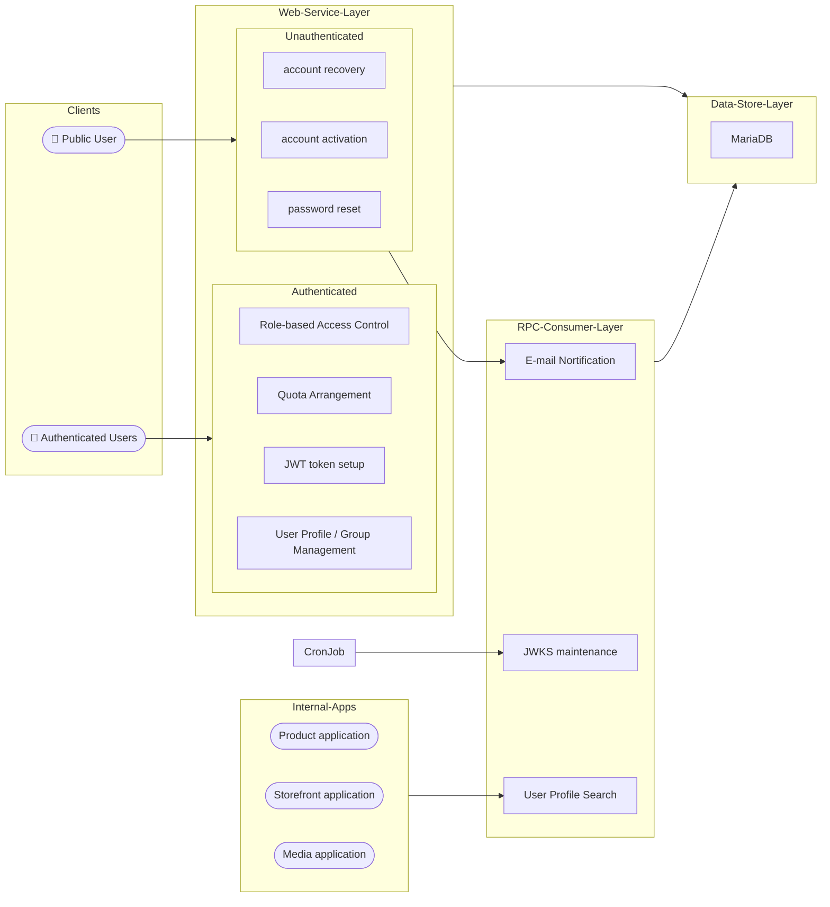

# User-Management Application
## Features
#### Role-Based Access Control
- each user can be assigned a custom set of roles, with each role containing specific set of low-level permissions
- the permission model defines whether a role is allowed to perform certain operation on specific resource of specific application.

#### Quota management
- enforces limits on various resource types (materials) within a specific application.
- each user can be assigned a custom set of quota arrangements

#### Authentication / Authorization
- manage login account
- JWT token setup with JWKS support
- identity verification, permission / quota check with JWT
- unauthenticated token-based account maintenance, with email notification

#### User Profile  / Hierarchical Group Management
- user profile maintains contact information, quota, and role assignments
- supports inheritance of quotas / roles from group to their members
- Enable activation / deactivation of a linked login account.

## High-Level Architecture




## Pre-requisite
| software | version | installation/setup guide |
|-----|-----|-----|
|Python | 3.13.5 | [see here](https://github.com/metalalive/EnvToolSetupJunkBox/blob/master/build_python_from_source.md) |
|MariaDB| 11.8.2 | [see here](https://github.com/metalalive/EnvToolSetupJunkBox/blob/master/mariaDB/server_setup_11.2.md) |
|pipenv | 2025.0.4 | [see here](https://pip.pypa.io/en/stable/) |
|pip| 25.1 | [see here](https://pip.pypa.io/en/stable/) |
|OpenSSL| 3.1.4 | [see here](https://raspberrypi.stackexchange.com/a/105663/86878) |


## Build
For full build / test instructions please refer to [github action workflow script](../../.github/workflows/usermgt-ci.yaml)

### Base Image for Application Environment
```bash
cd /path/to/project-home/services

docker build --tag=usrmgt-backend-base:latest --file=user_management/infra/Dockerfile  .

docker image rm  usrmgt-backend-base:latest
```

After custom image `usrmgt-backend-base:latest` is built successfully, use it for one of following tasks
- run application in development ensironment
- run all test cases

---

### Deprecated Build Flow
Following build flow is deprecated and no longer maintained.

#### Virtual Environment
You can create per-project virtual environment using the command:
```bash
PIPENV_VENV_IN_PROJECT=1 pipenv run python -m venv ./.venv
```
A virtual environment folder `.venv` will be created under the application folder `./user_management`

#### Common Python modules
Note in this application the building process on [common python modules](../common/python) is automated , see the `[packages]` section in [`Pipfile`](./Pipfile).

First time to initialize
```shell
pipenv install --dev
```

If you need to modify the `Pipfile` or `pyproject.toml` , update the virtual environment after you are done editing , by the command
```shell
pipenv update  <optional-specific-package>
```

Clean up dependencies in current virtual environment
```shell
pipenv uninstall --all

pipenv uninstall <optional-specific-package>
```

#### C extension modules
Manually install it by following command :
```bash
pipenv run pip install ../common/python/c_exts/dist/my_c_extension_lib-0.0.2-xxxxx.whl
```

The package title should be `my-c-extention-lib`. Once you need to remove the extension , run
```bash
pipenv run pip uninstall my-c-extention-lib
```

See [the documentation](../common/python/README.md) for build process.

#### Database Migration
##### Avoid unused Django models built in database
- Developers can set `managed = False` to the model class `User` and `Group` in module `django.contrib.auth.models`, this service does not need the 2 Django models.
- Alternatively, developers can manually drop the tables `auth_user` or `auth_group` after they are created.

##### Initial migration
For schema update, use Django migration script
```bash
pipenv run python3 manage.py makemigrations user_management  --settings settings.migration

pipenv run python3 manage.py migrate user_management  <LATEST_MIGRATION_VERSION>  --settings settings.migration  --database site2_dba
```

###### default user setup
For default user setup (staff, superuser) to the schema, run following script
```bash
pipenv run python3 -m  user_management.init_users
```
which automatically generates default fixture records (which includes default roles, default login users ... etc.) for data migrations in `user_management` application.

###### Permissions / quota code setup
Permissions / quota code setup for other remote applications can be done with following command

```bash
pipenv run python3 ./manage.py  loaddata  --database usermgt_service  --settings settings.development
    [-v {0,1,2,3}]  fixture  remoteapps_quota_perm_fixtures.json
```

---

## Run
### development environment
database server and migration process are encapsulated in docker container, check following command :

```bash
# build up database, docker network ... etc.
docker compose --file  ./infra/docker-compose-generic.yml --file ./infra/docker-compose-dev.yml \
    --env-file ./infra/interpolation-dev.env  up --detach

# stop database, docker network ... etc then remove them.
docker compose --file  ./infra/docker-compose-generic.yml --file ./infra/docker-compose-dev.yml \
    --env-file ./infra/interpolation-dev.env  down  --volumes
```

- database server is always started by default.
- consider extra options when starting application:
  - `--profile serverstart`: perform database schema migration, start API server, and RPC consumer database 
  - `--profile initialstart`: set up minimal user data for initial application launch after database schema migration

---
### application server
```bash
pipenv run python3 ./manage.py runserver --settings  settings.development  8008 \
    >& ../tmp/log/dev/usermgt_app.log &
```

### RPC consumer
```bash
DJANGO_SETTINGS_MODULE="settings.development" SYS_BASE_PATH="${PWD}/.."  \
    pipenv run  celery --app=ecommerce_common.util  --config=user_management.celeryconfig \
    worker --concurrency 1 --loglevel=INFO  --hostname=usermgt@%h  -E  \
    --logfile=../tmp/log/dev/usermgt_celery.log  &
```
Note:
*  `-Q` is optional, without specifying `-Q`, Celery will enable all queues defined in celery configuration module (e.g. `user_management.celeryconfig`) on initialization.
* `--logfile` is optional
* `--concurrency` indicates number of celery processes to run at OS level, defaults to number of CPU on your host machine


## Test
```bash
cd /path/to/project-home/services

docker --debug run --interactive --tty  --network=ec-usrmgt-test-net \
  --volume "$PWD/user_management/infra/run_test_container:/app/entry/run_my_app" \
  --name usrmgt-backend-testapp-0  usrmgt-backend-base:latest

docker stop usrmgt-backend-testapp-0
```

alternatively you can use `docker compose` :

```bash
# build up database, docker network ... etc.
docker compose --file  ./infra/docker-compose-generic.yml --file ./infra/docker-compose-test.yml \
    --env-file ./infra/interpolation-test.env  up --detach

# stop database, docker network ... etc then remove them.
docker compose --file  ./infra/docker-compose-generic.yml --file ./infra/docker-compose-test.yml \
    --env-file ./infra/interpolation-test.env down  --volumes
```


## Development
### Code Formatter
```bash
pipenv run black  --extend-exclude="src/migrations/.*\.py$"  ./src/ ./tests/  ./settings/
```

### Linter
```bash
pipenv run ruff check  ./src/ ./tests/  ./settings/
```
